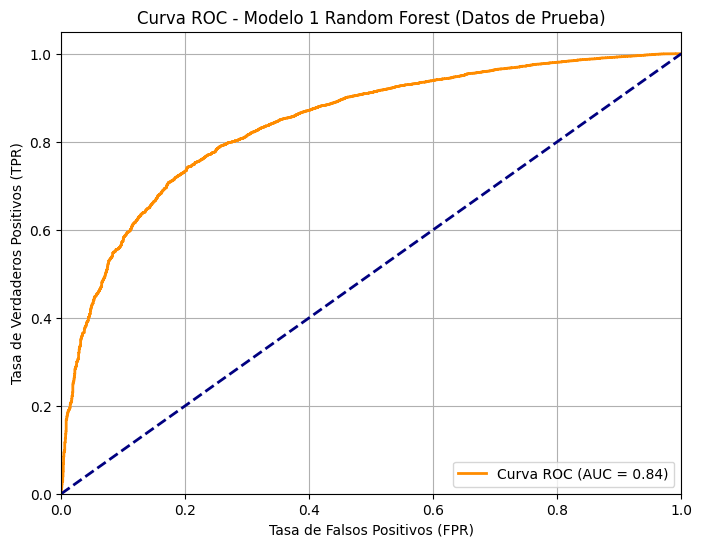
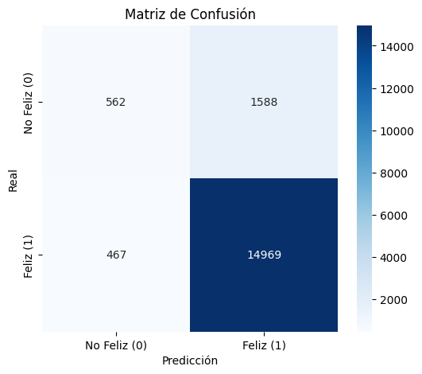
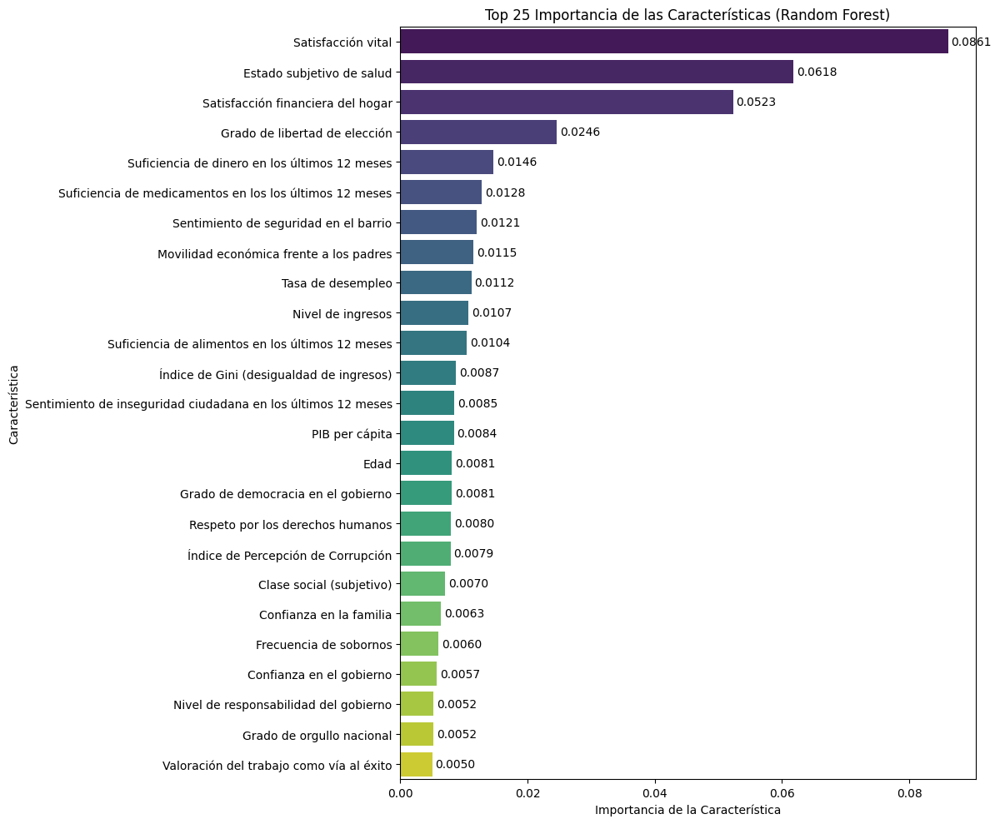

# Global Happiness Prediction Using Random Forest

## Project Overview

This project analyzes the main factors associated with self-reported happiness using data from the World Values Survey Wave 7 (2017–2022).

The objective is to predict whether individuals report being happy or not using a Random Forest classifier and a large set of socio-demographic, economic, health, political, cultural and attitudinal variables.

The analysis includes 57 countries and 86,114 observations after data cleaning and preprocessing.

## Research Question

Which individual, social, economic and attitudinal factors are most strongly associated with self-reported happiness across countries?

## Dataset

The main data source is the World Values Survey Wave 7 (2017–2022). Additional country-level variables were integrated from the World Bank and Transparency International, including:

* GDP per capita
* Unemployment rate
* Gini index
* Corruption Perceptions Index

The original WVS dataset is not included in this repository due to redistribution restrictions. Researchers can request access directly from the World Values Survey website.

## Methodology

The project follows a supervised machine learning approach:

1. Data cleaning and preprocessing
2. Treatment of missing values
3. Feature selection and transformation
4. One-Hot Encoding of categorical variables
5. Train-test split grouped by country
6. Random Forest classification
7. GroupKFold cross-validation
8. Model comparison with and without life satisfaction
9. Feature importance analysis

The target variable is binary:

* `1`: Happy
* `0`: Not happy

It was created from the original WVS happiness question.

## Models

Two Random Forest models were trained:

### Model 1

Includes life satisfaction as a predictor.

### Model 2

Excludes life satisfaction to test whether the model remains robust without a closely related variable.

## Results

### Model 1: Random Forest with life satisfaction

| Metric    | Test Score |
| --------- | ---------- |
| Accuracy  | 0.8831     |
| Precision | 0.9041     |
| Recall    | 0.9697     |
| F1-score  | 0.9358     |
| ROC-AUC   | 0.8409     |

### Model 2: Random Forest without life satisfaction

| Metric    | Test Score |
| --------- | ---------- |
| Accuracy  | 0.8776     |
| Precision | 0.9003     |
| Recall    | 0.9677     |
| F1-score  | 0.9328     |
| ROC-AUC   | 0.8126     |

The results show that both models perform well, especially when predicting individuals classified as happy. However, the class imbalance affects the model’s ability to correctly identify the minority class: individuals classified as not happy.

## Visualizations

### ROC Curve



### Confusion Matrix



### Feature Importance



## Key Findings

The most relevant predictors of happiness were related to:

* Life satisfaction
* Subjective health
* Financial satisfaction of the household
* Freedom of choice and control
* Sufficient income
* Access to medical treatment
* Perceived neighborhood safety
* Economic mobility
* Unemployment rate
* Income level

The findings suggest that happiness is more strongly associated with individual-level conditions than with aggregate macroeconomic indicators.

## Technologies Used

* Python
* Pandas
* NumPy
* Matplotlib
* Seaborn
* Scikit-learn
* SciPy
* Google Colab

## Repository Structure

```text
global-happiness-prediction-random-forest/
│
├── Global_Happiness_Prediction_Using_Random_Forest.ipynb
│
├── images/
│   ├── happiness_by_region.png
│   ├── confusion_matrix.png
│   ├── roc_curve.png
│   └── feature_importance.png
│
├── data/
│   └── README.md
│
├── requirements.txt
│
└── README.md
```

## How to Run

Install the required libraries:

```bash
pip install -r requirements.txt
```

Then open the notebook:

```bash
Global_Happiness_Prediction_Using_Random_Forest.ipynb
```

Due to WVS data redistribution restrictions, the original dataset is not included in this repository.

## Skills Demonstrated

- Development of machine learning models for predicting subjective well-being
- Analysis of large-scale international survey data (World Values Survey)
- Feature engineering and preprocessing of social science datasets
- Random Forest classification and model optimization
- Group-based cross-validation to prevent country-level data leakage
- Evaluation of predictive performance using F1-score and ROC-AUC
- Interpretation of factors associated with happiness across countries
- Data visualization and exploratory data analysis
- Computational social science methods
- Python-based data science workflows

## Author

Carlos F. Carreras De León

MSc in Social Data Science

University of Granada
